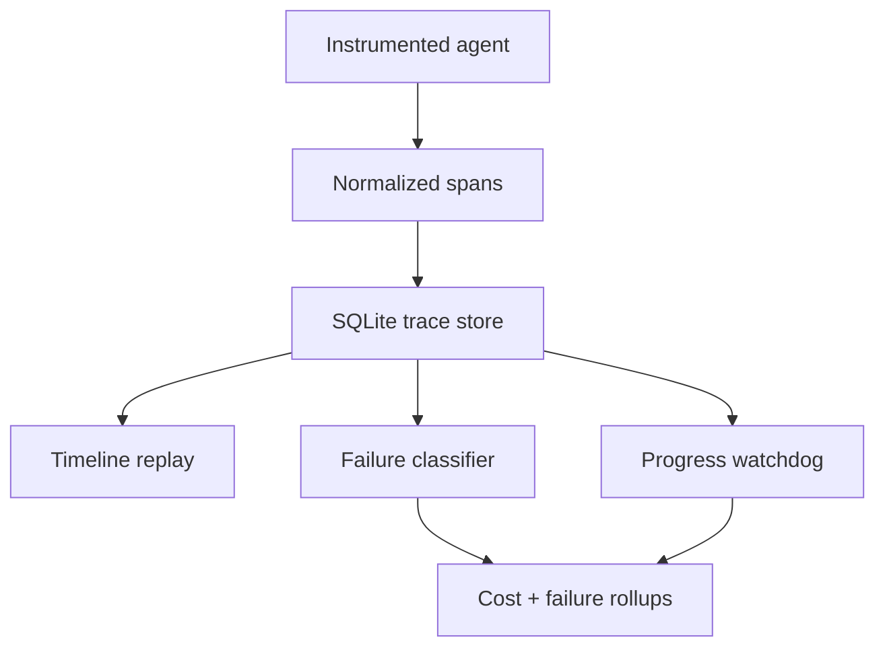

# TraceLoom

[](https://github.com/MadanMohan0537/traceloom/actions/workflows/ci.yml)

TraceLoom turns multi-step agent logs into replayable timelines, failure classifications, cost-per-success rollups, and progress-aware loop alerts. It is local, deterministic, dependency-free, and designed to show why a run failed—not just that it failed.

> **Project Lab traceability:** catalog project 05, originally “Agent Observability Console.” TraceLoom is the product name; this metadata prevents the renamed idea from being built twice.

## Problem

Agent logs are usually a wall of prompts and tool results. Operators cannot quickly locate the broken step, distinguish expensive success from cheap failure, or catch a loop whose actions keep changing. TraceLoom stores normalized spans and applies a small, auditable failure taxonomy plus an explicit milestone model.

## Implemented scope

- Span schema for plans, model calls, tool calls, results, timings, tokens, cost, status, inputs, outputs, and milestones.
- SQLite trace store with deterministic replacement and ordered replay.
- Six useful failure classes: wrong tool, bad arguments, loop, timeout, refusal, and silent wrong answer, plus `unknown`.
- Per-run timeline data and a standalone HTML console report.
- Rollups for success rate, failure mix, token use, total cost, classification coverage, and **cost per successful task**.
- **P1 semantic-progress watchdog:** flags action windows with no milestone changes, even when tools differ.
- Frozen comparison against repeated-tool detection with recall and false-alert denominators.
- Five synthetic traces covering success, semantic looping, timeout, refusal, and benign repeated search.

Live OpenTelemetry ingestion, a hosted UI, auto-clustering, checkpoint recovery, authentication, and production redaction are planned—not implemented.

## Quick start

```bash
python -m venv .venv
source .venv/bin/activate
python -m pip install -e .
traceloom demo --db traceloom.db --json report.json --html report.html
open report.html
```

Run the test suite:

```bash
python -m unittest discover -s tests -v
```

No API key, network connection, model download, or paid service is required.

## Architecture



Every replay uses recorded tool inputs and outputs; it does not rerun side effects. This keeps the MVP safe and reproducible.

## Failure taxonomy

| Class | Detection signal | Important limitation |
|---|---|---|
| Wrong tool | Span status from instrumentation | Requires the host to validate tool choice |
| Bad arguments | Tool validation status | Schema correctness is not semantic correctness |
| Infinite loop | No milestones across an action window | Exploration can be useful; grace periods are task-specific |
| Timeout | Explicit timeout status | Does not identify the underlying service cause |
| Refusal | Explicit refusal status | Appropriate refusals should not be treated as product defects |
| Silent wrong answer | Failed run with otherwise successful spans | Requires an external task-success label |

## P1 experiment

The frozen fixtures include an agent that calls `lookup`, `reroute`, `notify`, and `replan` without reaching a new milestone. A repeated-tool detector misses it because every action differs. The semantic watchdog catches it. A separate successful run repeats `search` three times but reaches a source milestone; the semantic watchdog does not alert, while the naive detector does.

The report records true positives, false positives, false negatives, recall, and false-alert rate for both methods. Five fixtures demonstrate mechanics; they are not evidence of production accuracy.

## Metrics

Cost per run can reward systems that fail cheaply. TraceLoom instead makes cost per successful task the headline metric:

\[
\text{cost per success}=\frac{\sum \text{span cost across all runs}}{\text{successful tasks}}
\]

When there are no successes the value is `null`, not zero.

## Limitations

- The fixture prices are synthetic and must not be interpreted as vendor pricing.
- Failure classification is deterministic and only as reliable as span statuses and task-success labels.
- Milestones must be defined by the instrumented task; missing instrumentation can create false alerts.
- The default three-action window and one-action grace period are examples, not calibrated production thresholds.
- SQLite fits a single-node portfolio MVP, not high-volume distributed ingestion.
- Recorded prompts and tool results may contain secrets or personal data; this MVP has no automatic redaction or retention enforcement.
- The HTML report is static and unauthenticated. Do not expose it to the internet with real traces.
- Replay is inspection of recorded results, not execution; checkpoint recovery remains planned.

## Repository map

```text
traceloom/
  models.py       trace contracts
  store.py        SQLite ingestion and replay
  classifier.py   failure taxonomy
  watchdog.py     semantic and repeated-tool detectors
  metrics.py      cost and watchdog experiment rollups
  fixtures.py     reproducible synthetic runs
  report.py       JSON and HTML console output
tests/             behavior and integration tests
docs/              architecture and rigorous backlog
```

## Roadmap

See [docs/BACKLOG.md](docs/BACKLOG.md) for prioritized features with their user problem, behavior, dependencies, success test, and tradeoffs. [docs/ARCHITECTURE.md](docs/ARCHITECTURE.md) describes data boundaries and production hardening.

## License

MIT

